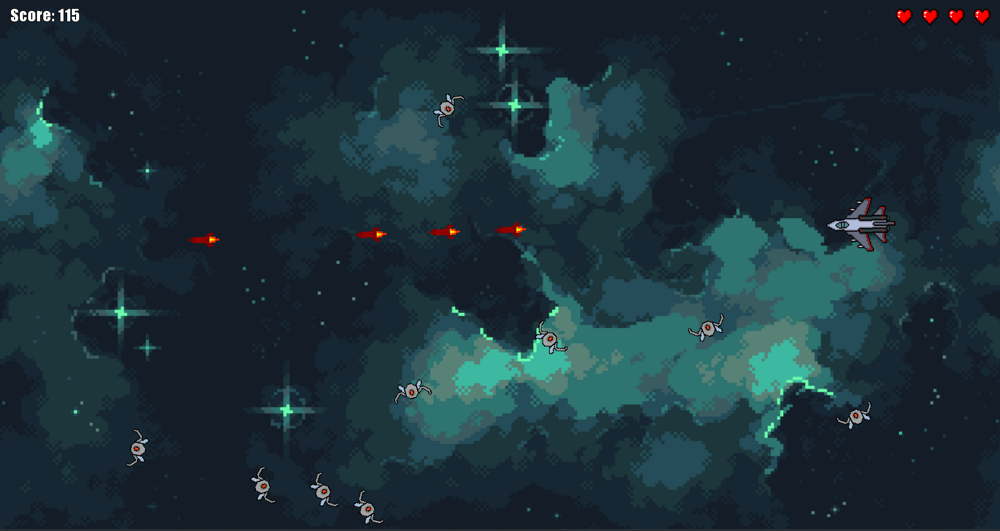

# Spaceship Game

> Mini game Space Shooter feito em Java com a framework LibGDX durante dois fins de semana com objetivo de estudo da linguagem Java.

---

Projeto inspirado e assets retirados da série de vídeos do canal [Terminal Root](https://youtu.be/2bmvlwvnirk)

---



---

## Como jogar
Clone o repositório na sua máquina e dentro do diretório do jogo, rode o seguinte comando:
```bat
.\gradlew.bat run
```
ou para linux:
```bash
./gradlew run
```

---

